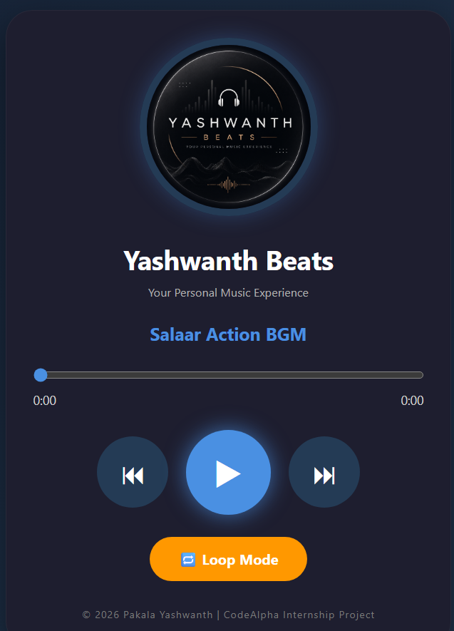

# 🎵 Yashwanth Beats - Music Player

A modern music player web application built using HTML, CSS, and JavaScript as part of the CodeAlpha Frontend Development Internship.

## 🌐 Live Demo

https://yashwanthpakala.github.io/CodeAlpha_MusicPlayer/

## 📸 Preview

## 🚀 Features

* Play and Pause Music
* Next and Previous Song Controls
* Loop Mode
* Interactive Progress Bar
* Song Duration Tracking
* Rotating Album Cover Animation
* Modern Dark Theme UI
* Responsive Design
* Custom Yashwanth Beats Branding

## 🛠️ Technologies Used

* HTML5
* CSS3
* JavaScript

## 📂 Project Structure

CodeAlpha_MusicPlayer

├── index.html

├── style.css

├── script.js

├── images/

│ ├── yashwanth-beats-cover.png

│ └── music-player.png

└── songs/

├── salaar_action_bgm.mp3

└── salaar_climax.mp3

## 👨‍💻 Developer

**Pakala Yashwanth**

## 🎯 Internship

CodeAlpha Frontend Development Internship

## 📌 Project Highlights

* Clean and professional UI design
* Real-time music progress tracking
* Smooth album cover animation
* Custom music player controls
* Hosted using GitHub Pages

## 🔗 Repository

https://github.com/YASHWANTHPAKALA/CodeAlpha_MusicPlayer
